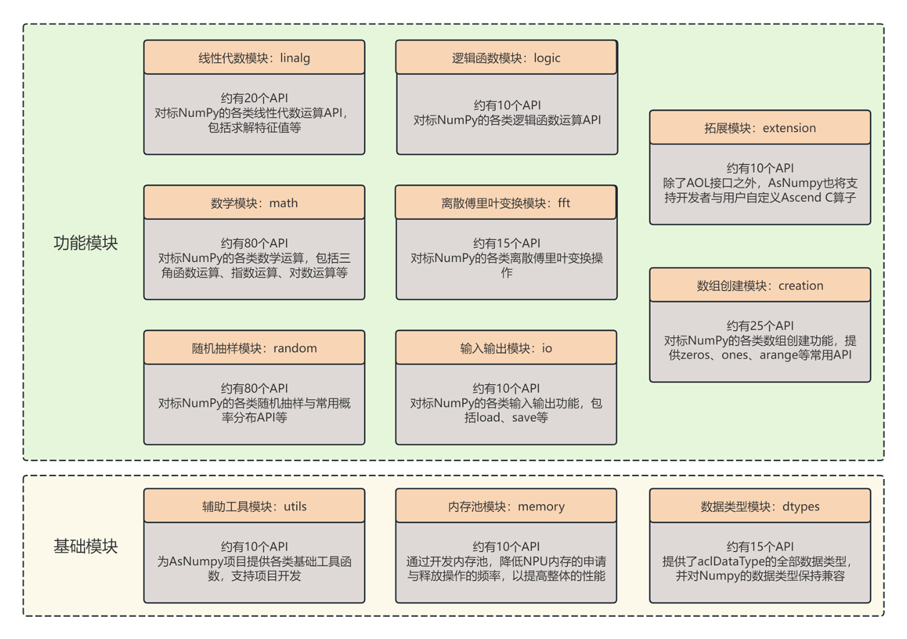
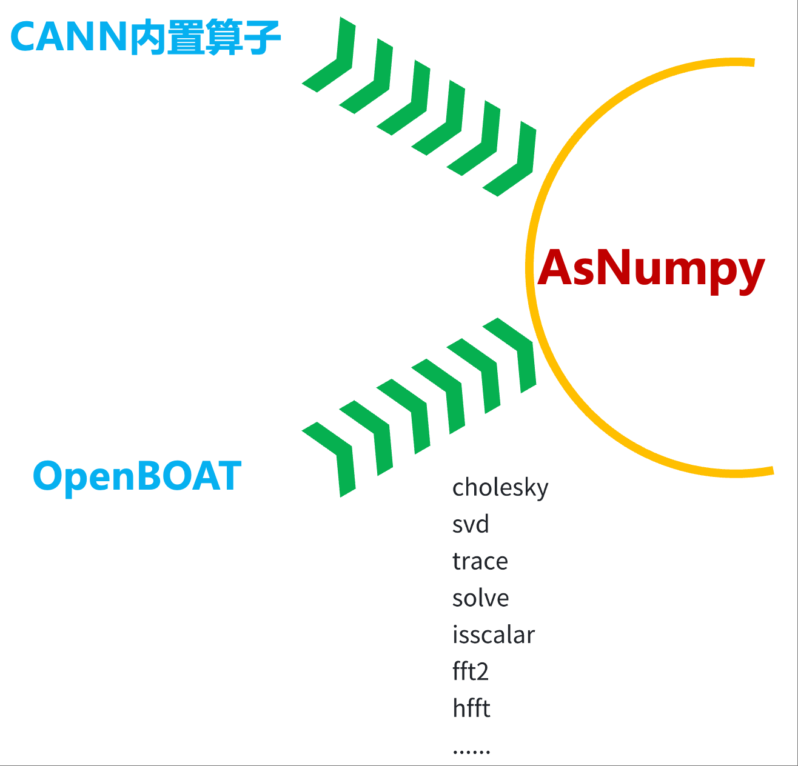

# 📘 AsNumpy--昇腾NPU原生Numpy

在人工智能与深度学习飞速发展的当下，高效、友好的计算工具成为开发者们的迫切需求。随着算力需求的不断攀升，专用计算芯片及相应的软件生态愈发重要。值得注意的是，**截至2025年8月2日，Python 以26.14% 的占比成为 Tiobe 历史上最受欢迎的编程语言**，在科学计算、数据分析与人工智能领域均占据主导地位。而在 Python 生态中，**Numpy 是基石性的数学运算库**，为后续的诸多深度学习框架和工具提供了底层支撑。

> ❗ 为进一步提升开发者在昇腾 NPU 上的计算体验，哈尔滨工业大学计算学部苏统华教授团队联合华为团队打造了 **昇腾 NPU 原生 Numpy —— AsNumpy**。

AsNumpy 是一款 **深度支持昇腾 NPU 并高度兼容 Numpy 接口的轻量级 Python 数学运算库**。  
通过精心设计的 **NPUArray 核心数据结构**，AsNumpy 在 Python 层完全兼容 Numpy API，同时在 C++ 底层深度集成了 **华为 Ascend C 算子库**，对 NPU 算子（包括数学运算、线性代数、随机采样等）进行系统化封装，并高效管理 `dtype`、`shape` 以及 `aclTensor` 等底层资源，实现了与主机端 `numpy.ndarray` 的双向拷贝。借助 **pybind11** 实现高效的 Python-C++ 接口绑定，使用户能够像使用 Numpy 一样在 NPU 上无缝创建、操作张量。  

---
## ✨核心优势

与 Numpy 接口高度兼容，几乎无需额外学习成本，即可释放昇腾 NPU 的高效原生计算能力。

---
## 💡设计理念

### 数据结构 NPUArray

`NPUArray` 是 AsNumpy 的核心数据结构，设计理念主要体现在以下三个方面：

#### 🔄 兼容性
在 Python 层完全兼容 **Numpy API**，为用户提供与 `ndarray` 无缝衔接的体验。  
这意味着你可以像使用 **Numpy** 一样使用 `NPUArray`。

#### 📦 内部封装
`NPUArray` 内部封装了 `dtype`、`shape` 等基本信息，以及底层的数据 `aclTensor`。  
用户在 Python 层操作时，无需关心底层复杂的细节。

#### 🗂️ 资源管理
`NPUArray` 提供了方便的构造函数，并且在对象不再使用时，会自动调用析构函数释放资源。  
这种设计避免了手动管理内存可能引发的内存泄漏问题，使用户能够更加专注于算法逻辑。

---

### **API 架构**

AsNumpy 的 API 架构分为 **功能模块** 与 **基础模块** 两大类，目前已实现约 **113 个 API**（含十几个功能尚不完全支持的接口，以及若干对参数 `shape` 有特殊限制的接口）。此外，还有 **10 个 API** 因代码问题尚未合并，以及 **11 个内部 `utils` 接口** 仅供开发者使用。  

API 架构设计示意图如下所示：



#### 📊 具体功能
AsNumpy 已实现涵盖 **[数学运算](docs/math/)**（三角函数、指数、对数等常见数学计算）、线性代数（矩阵运算与分解）、**[随机抽样](docs/random/)**、**[逻辑函数](docs/logic/)**、**数组创建**、**输入输出**等多个功能模块，以及 **辅助工具**、**内存池管理**、**数据类型** 等基础模块，为开发者提供全面的科学计算支持。

详细 API 列表请参阅 [docs](docs/) 目录下的各模块文档。 

📌 **总结**  
- 目前 AsNumpy 共规划约 **260 个接口**。  
- 已实现并合并：**113 个**  
- 待合并：**10 个**  
- 内部 utils：**11 个**  
- 数学模块是主要进展，随机模块由于复杂性进度相对缓慢，线性代数模块则在整理后逐步合并。  

---

### 🚀 NPU 扩展功能模块

由于 CANN 内置算子主要面向 AI 编程与神经网络训练等深度学习场景，而 AsNumpy 作为通用科学计算库，更侧重于数据计算、处理与分析等传统数值计算场景，两者的应用领域存在差异。在将 Numpy 的完整 API 体系迁移到 NPU 的过程中，AsNumpy 会面临算子覆盖度不足的挑战。为此，引入了 **NPU 扩展功能模块**，通过自研算子与开源算子库相结合的方式，提升 API 覆盖率与计算性能。

NPU扩展功能模块设计示意图如下所示：



#### ⚠️ 现有问题
- AsNumpy 需要封装 CANN 内置算子。  
- CANN 内置算子无法覆盖 NumPy 的全部 API。  

#### 💡 解决方案
- 对缺失的算子进行手动开发。  
- 借助 **OpenBOAT** 开源算子库来补齐算子。  
- 优先安排缺失算子的开发计划。  

#### 🌟 价值体现
- **OpenBOAT** 为 AsNumpy 提供算子支持。  
- 推动 AsNumpy 兼容更多 NumPy API。  
- 加速 AsNumpy 项目的落地与完善。  

> 📌 **说明**：  
> OpenBOAT 是由 **哈尔滨工业大学计算学部苏统华教授团队** 设计的 Ascend C 算子仓库，能够为 AsNumpy 提供灵活的算子扩展支持。

---
## 📐 使用方式对比：Numpy vs AsNumpy
> 💻 下面展示一组代码示例，帮助开发者直观对比 **Numpy** 与 **AsNumpy** 的使用差异。

### 使用 **Numpy** 实现矩阵元素乘积与求和
```python 
import numpy as np
rows = 20000  
cols = 20000 
m1 = np.random.normal(...)
m2 = np.random.normal(...)
elementwise_product = np.multiply(m1, m2)
total_sum = np.sum(elementwise_product) 
```

### 使用 **AsNumpy** 实现矩阵元素乘积与求和
```python
import asnumpy as ap 
m1_npu = ap.ndarray.from_numpy(m1)
m2_npu = ap.ndarray.from_numpy(m2)
elementwise_product = ap.multiply(m1_npu, m2_npu)
total_sum = ap.sum(elementwise_product) 
```

---
## 🚀 已支持功能

| 功能                                         | 状态     |
| -------------------------------------------- | -------- |
| AscendCL 系统配置与运行时管理                 | ✅ 已完成 |
| NPUArray 数据结构                            | ✅ 已完成 |
| 基础创建函数：`ones`、`zeros`                 | ✅ 已完成 |
| 与 Numpy 双向拷贝（`to_numpy`、`from_numpy`） | ✅ 已完成 |
| 完整 Numpy API 兼容                          | 🚧 进行中 |
| 更多逐元素 / 规约算子                        | 🚧 进行中 |


---

## 📊 性能测试

以不同形状的张量作为输入，针对 **AsNumpy 与 Numpy** 进行背对背测试。  
示例：`multiply()` 函数，数据类型为 `float32`，测试时间单位为秒（小数点后四位）。  

> 可以看出，在一定规模下，NPU 的原生计算能力能得到充分释放。  

| 张量形状             | AsNumpy 执行时间 (s) | Numpy 执行时间 (s) | 加速比   |
| -------------------- | -------------------- | ------------------ | ------- |
| (500, 500)       | 1.9355               | 0.1708             | 0.09×   |
| (1000, 1000)      | 0.0692               | 0.7029             | 10.16× |
| (2000, 2000)     | 0.1033               | 3.8387             | 37.17× |
| (3000, 3000)    | 0.1115               | 14.3567             | 128.70× |


---

## ⚙️ 使用说明

本仓库目前支持用户以 **源代码编译安装** 的方式使用，后续将以 `whl` 包形式提供预编译版本。  

**环境要求**：  
- 操作系统：Linux  
- 编译工具：`gcc >= 11.2`、`ninja-build`  
- Python：`>= 3.9`  
- 硬件环境：昇腾 910B  
- 软件环境：`CANN 8.2.RC1.alpha003` 已安装  

**用户使用方式**：
```bash
git clone --recursive https://gitcode.com/cann/asnumpy.git
cd asnumpy
pip install .
```

**开发者使用方式**：
```bash
git clone --recursive https://gitcode.com/cann/asnumpy.git
cd asnumpy
mkdir build && cd build
cmake .. -GNinja && ninja
```
> 构建产物将位于 `asnumpy/lib` 子文件夹下。  
开发者可在 `src` 与 `include` 文件夹中开发新的 API。


---

## 🧭 下一步计划（欢迎贡献）

| 阶段       | 目标                                                                 |
| ---------- | -------------------------------------------------------------------- |
| **v0.2**   | 内部代码 **面向对象** 重构，结构更清晰                                |
| **v0.3**   | 支持逐元素 & 规约算子：`sum`、`matmul` …                              |
| **v1.0**   | **兼容 Numpy 使用率前 100 的 API，支持大部分 Numpy 算法迁移至 AsNumpy** |
| **v2.0**   | **扩展 Ascend C 算子库，支持使用自定义 Ascend C 算子**                |


---

## 👥 贡献者

- 哈尔滨工业大学苏统华老师团队  
- 王甜甜老师团队  
- 华为 CANN 团队  


---

## 📄 开源协议

Apache License, Version 2.0 © 2024-2025 AsNumpy 贡献者
