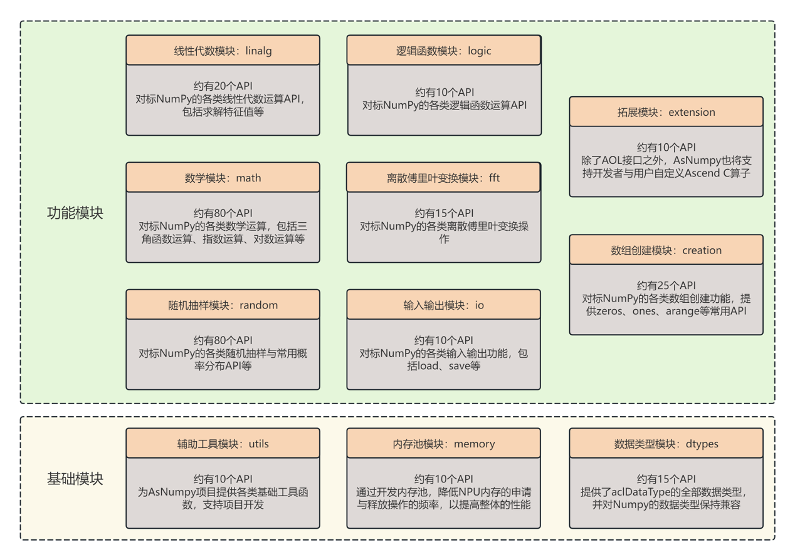
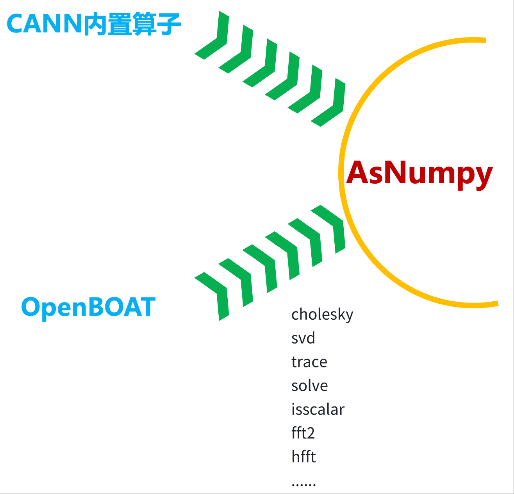

# Architecture

> Back to [README](../README.md)

This document describes the internal architecture of AsNumpy, including the three-layer design, the core `NPUArray` data structure, the API module layout, and the NPU extension strategy via OpenBOAT.

## Three-Layer Architecture

AsNumpy is built on three layers that cleanly separate concerns:

```
+------------------------------------------+
|     Python Frontend (asnumpy/*.py)        |
|  - __init__.py   122+ exported symbols    |
|  - array.py      array creation (10 fn)   |
|  - math.py       math ops (80+ fn)        |
|  - linalg/       linear algebra           |
|  - random/       random sampling          |
|  - logic.py      logic functions (16 fn)  |
|  - nn.py         neural network (softmax) |
|  - statistics.py statistics (mean)        |
+------------------------------------------+
                    |
         pybind11 binding layer (python/*.cpp)
         PYBIND11_MODULE(asnumpy_core, ...)
                    |
+------------------------------------------+
|     C++ Core (src/, include/)             |
|  - NPUArray      core data structure      |
|  - namespace asnumpy  operator impls      |
|  - Ascend ACL / ACLNN operator wrappers   |
|  - CANN Runtime  device management        |
+------------------------------------------+
                    |
    Huawei CANN (ascendcl, runtime, nnopbase, opapi)
                    |
+------------------------------------------+
|     Ascend NPU Hardware (910B)            |
+------------------------------------------+
```

## NPUArray Design

`NPUArray` is the core data structure of AsNumpy. It is designed around three principles:

### Compatibility

`NPUArray` exposes the same interface as `numpy.ndarray` at the Python level. Functions are named identically (`add`, `multiply`, `matmul`, …) so existing NumPy code can be migrated by changing the import and adding data transfer calls.

### Encapsulation

Internally, `NPUArray` holds:
- `dtype` — element type (`aclDtype`)
- `shape` — dimension sizes
- `strides` — memory layout
- `tensorPtr` — pointer to the underlying `aclTensor`
- `devicePtr` (private) — raw device memory address, exposed via `device_address()`

Users never interact with these fields directly; the Python layer presents a clean ndarray-like interface.

### Resource Management

`NPUArray` follows RAII: the destructor automatically calls `aclDestroyTensor` and `aclrtFree`, eliminating manual memory management. All four C++ value semantics are implemented (copy constructor, move constructor, copy assignment, move assignment).

Data transfer:
- `FromNumpy` — uses `ACL_MEMCPY_HOST_TO_DEVICE`
- `ToNumpy` — uses `ACL_MEMCPY_DEVICE_TO_HOST`; `float16` / `BF16` require special `uint16_t` unpacking

## API Architecture

AsNumpy's API is divided into **functional modules** and **foundation modules**:

<div align="center">

</div>

**Functional modules** cover the primary scientific computing domains:

| Module | Python | C++ namespace | Status |
|--------|--------|---------------|--------|
| Math (arithmetic, trig, exp, log) | `math.py` | `asnumpy::` | Complete |
| Linear algebra | `linalg/` | global | In progress |
| Random sampling | `random/` | global | In progress |
| Logic functions | `logic.py` | `asnumpy::` | Complete |
| Array creation | `array.py` | global | Complete |
| Sorting | `sorting.py` | global | Complete |
| Neural network | `nn.py` | `asnumpy::` | Complete (softmax) |
| Statistics | `statistics.py` | `asnumpy::` | Complete (mean) |
| I/O | `io.py` | delegated to NumPy | Complete |

**Foundation modules** support the functional layer:

| Module | Role |
|--------|------|
| `NPUArray` (`src/utils/`) | Core data structure |
| `CANN driver` (`src/cann/`) | Device initialization and lifecycle |
| `dtypes` (`src/dtypes/`) | Data type registration |
| `pybind11 bindings` (`python/`) | Python-C++ interface |

## NPU Extension Module

CANN's built-in operators are primarily designed for deep learning (training and inference). AsNumpy targets general scientific computing — data analysis, numerical methods, signal processing — which requires a broader operator set than CANN alone provides.

<div align="center">

</div>

**The gap:** CANN built-in operators cannot cover all of NumPy's API surface.

**The strategy:**
- Wrap existing CANN built-in operators directly
- Develop missing operators manually (Ascend C)
- Supplement with the [OpenBOAT](https://gitcode.com/HIT1920/OpenBOAT) open-source operator library

**The value:** This three-pronged approach progressively closes the compatibility gap toward the goal of covering the top 100 most-used NumPy APIs by v1.0.

## OpenBOAT

[**OpenBOAT**](https://gitcode.com/HIT1920/OpenBOAT) is an open-source Ascend C operator library built and maintained by the **AISS Group, School of Computer Science, Harbin Institute of Technology** (led by Prof. Su Tonghua).

| Attribute | Detail |
|-----------|--------|
| Project URL | [https://gitcode.com/HIT1920/OpenBOAT](https://gitcode.com/HIT1920/OpenBOAT) |
| Team | AISS Group, HIT — Prof. Su Tonghua |
| Technology | Huawei Ascend C programming language |
| Role in AsNumpy | Provides operator implementations not covered by CANN built-ins, enabling broader NumPy API compatibility |

AsNumpy and OpenBOAT are developed by the same research group, ensuring tight integration and coordinated roadmap planning.
